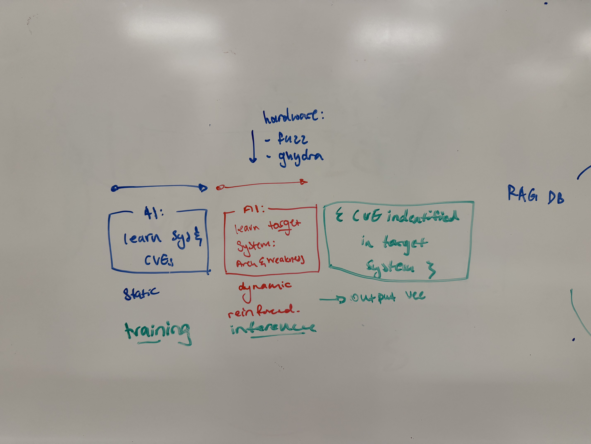
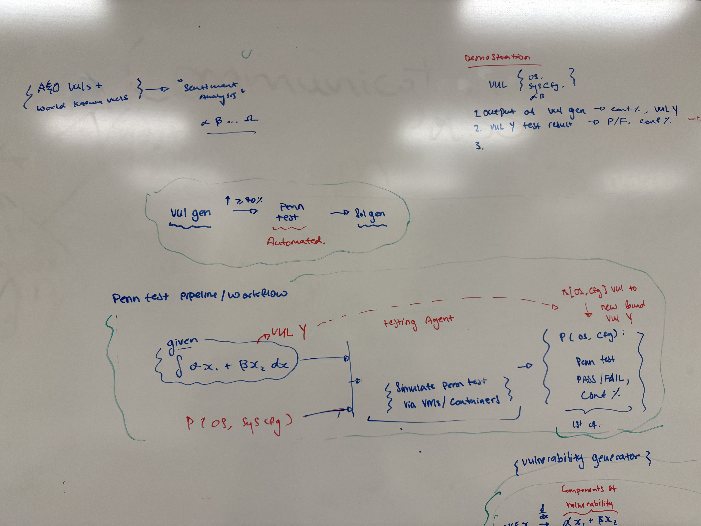
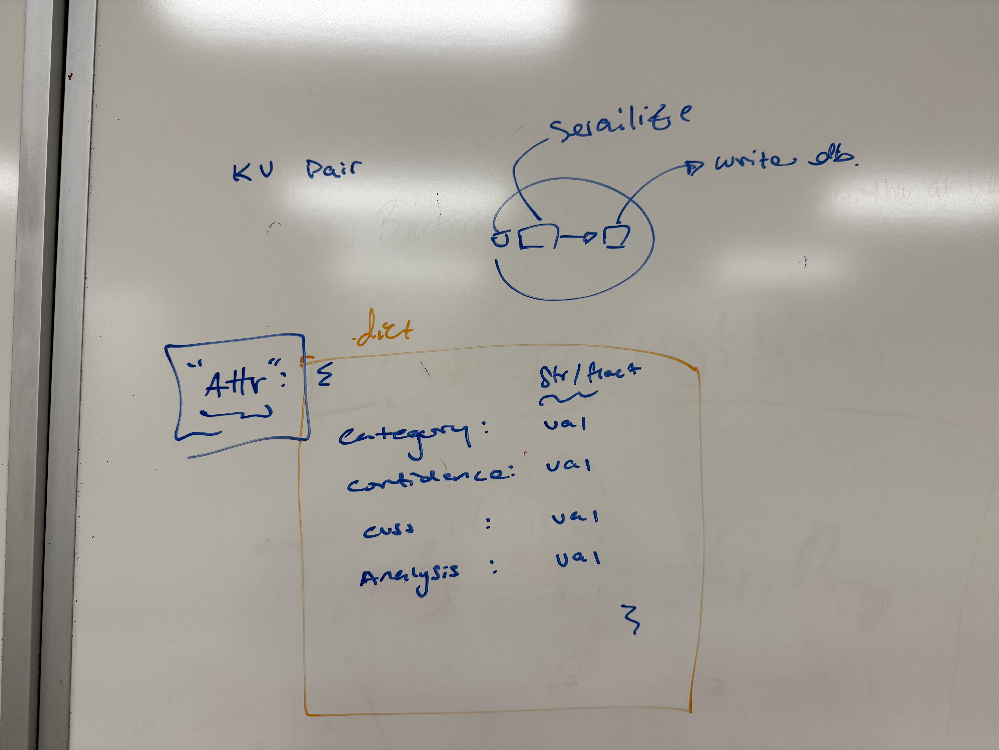

# Alpha and Omega Cyber Attack

The Beginning and the end for new 0-day network exploits.

# Overview
An enterprise B2B software suite that performs authorized, automated security assessments (red-team style simulations) and pairs those results with automated remediation orchestration. The system focuses on safe, auditable, customer-authorized testing in isolated environments and on delivering prioritized, actionable fixes integrated into customers' existing IT workflows.

**Key outcomes**: faster discovery of high-risk issues, prioritized remediation recommendations, integrated orchestration into ticketing/patch systems, and full auditability for compliance.

## Technical Approach

### Technology stack
  

---

### System architecture
  
**Description:** End-to-end system architecture including data flows between customer environments (sandbox VPCs), the orchestrator, secure connectors, external feeds, and the central Snowflake data layer.

---

### System workflow
  
**Description:** Operational workflow from onboarding & explicit authorization → scheduled scans/simulations → prioritized findings → remediation playbooks → automated remediation with approvals → audit & reporting.

---

### Ingest & ETL pipeline (1)
  
**Description:** High-level ETL flow showing external vulnerability feeds (CVE/NVD, vendor advisories), internal scanner outputs, and jobs that normalize and load data into Snowflake.

---

### Ingest & ETL pipeline (2)
  
**Description:** Detailed pipeline diagram covering enrichment steps (CVSS scoring, asset-context enrichment), alerting hooks, and downstream consumers (prioritization model, UI, remediation orchestrator).

---

### Database schema
  
**Description:** Entity-relationship diagram of the Snowflake schema used by the platform — tables (`assets`, `vuln_catalog`, `asset_vulns`, `remediation_actions`, `simulations`, `audit_log`), key relationships, and JSON/VARIANT columns for flexible metadata.

---

### UI designs / Dashboard
  
**Description:** Mockups of the product dashboard: asset inventory view, prioritized vulnerability list, remediation playbook details, remediation queue with approval flow, and audit log viewer.

---
